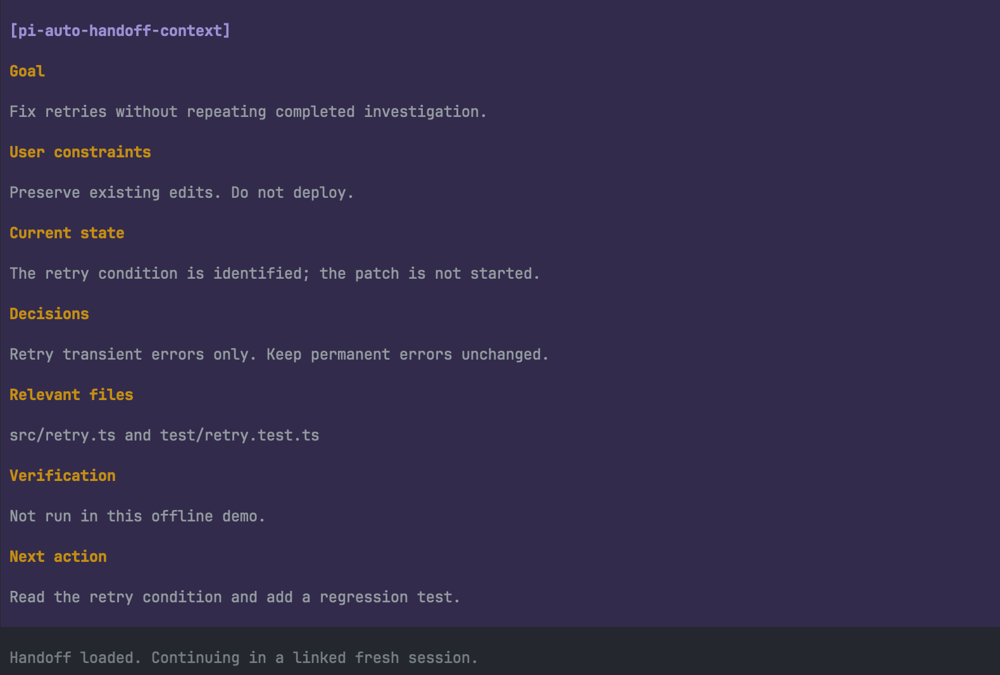

# pi-auto-handoff

Version **0.1.0**. [Changelog](CHANGELOG.md).

Save work checkpoints after inactivity or high context use. Continue in a linked fresh Pi session when ready.



## Install

Requires Pi 1.0.4 or later and Node.js 22.19 or later.

```sh
pi install npm:pi-auto-handoff
```

Or install from GitHub:

```sh
pi install git:github.com/dpaluy/pi-auto-handoff
```

Restart Pi or run `/reload`.

## Use

| Command | Action |
|---|---|
| `/handoff` | Save a checkpoint. |
| `/handoff status` | Show checkpoint status. |
| `/handoff continue` | Refresh if needed, start a linked fresh session, and continue immediately. |

Checkpoints are saved in Pi's session file, not project files. The original session remains available through `/resume`. Native compaction and cache warming are unchanged.

## Automatic checkpoints

Defaults: **50 idle minutes** or **70% estimated context use**. Automatic checkpoints run in TUI and RPC modes with saved sessions. Session replacement always requires `/handoff continue`.

Change thresholds when starting Pi:

```sh
pi --handoff-idle-minutes 30 --handoff-context-percent 80
```

Set either value to `0` to disable that trigger.

## Privacy

Checkpoint generation sends bounded session text to the active model provider. Provider charges or subscription limits can apply. Notes can contain sensitive information; secret removal is not guaranteed.

## License

[MIT](LICENSE.txt)

Supported by [Majestic Labs](https://majesticlabs.dev/).
